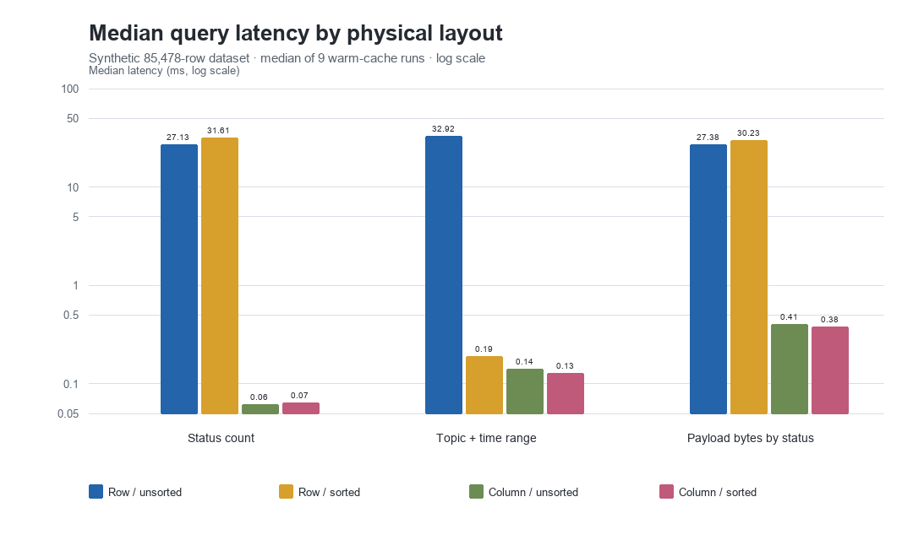
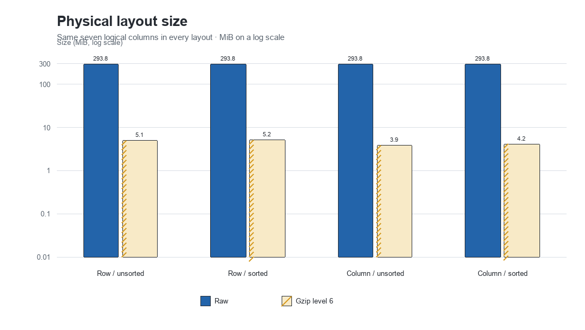
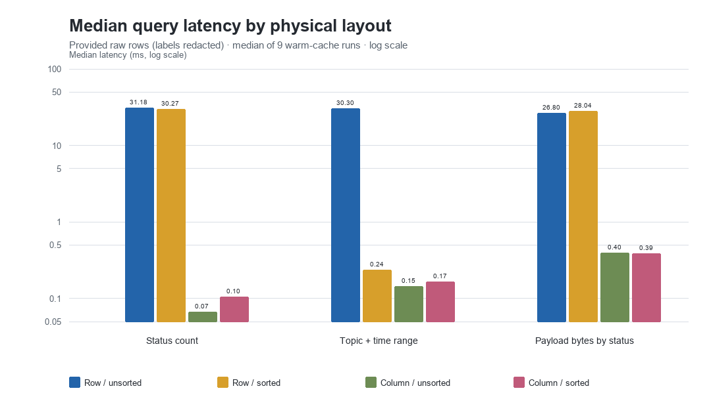
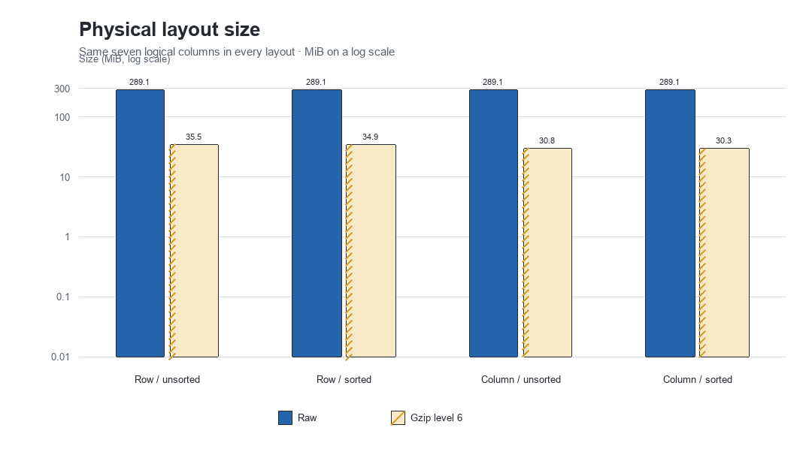

# C-Store physical-layout POC

A privacy-preserving proof of concept for one central idea in Stonebraker et al., **“C-Store: A Column-oriented DBMS” (VLDB 2005)**: column representation plus sorted projections.

The POC compares four custom binary layouts:

- row / unsorted
- row / sorted by `(topic_name, time, id)`
- column / unsorted
- column / sorted by `(topic_name, time, id)`

SQLite is **not** the benchmark engine. An uploaded database is opened read-only only to derive aggregate shape statistics. The program then generates synthetic rows and runs every measured query against custom row/column files.

The UI and CLI also support a **fully random** mode, so the experiment can run without any database upload.

Dataset provenance reference: [dingwen07/Bilibili-dynamic](https://github.com/dingwen07/Bilibili-dynamic). That upstream data-collection project is referenced only and is not bundled with this repository.

## Demo result

The checked-in demo uses 85,478 deterministic mock rows shaped like the supplied database, with no source row values retained.





Highlights:

- Unsorted column status scan: **433.8x faster** than unsorted rows.
- Unsorted column topic/time scan: **229.2x faster** than unsorted rows.
- Sorted row topic/time projection: **173.4x faster** than the unsorted row scan.
- Unsorted column gzip footprint: **23.2% smaller** than unsorted rows.
- Correctness passed for every query across all four layouts.

These are POC measurements, not general DBMS claims. The experiment uses a Python/NumPy executor, warm OS cache, one process, and synthetic data. It does not model updates, concurrency, transactions, buffer management, or cold-cache I/O.

### Provided database cross-check

The same custom-layout benchmark was also run on a private extraction of the provided rows. Only redacted aggregate results are checked in; the database, extract, physical layouts, source path/hash, IDs, labels, descriptions, payloads, and row-level output are excluded.





On the provided rows, the unsorted column layout was **466.8x**, **208.9x**, and **67.3x** faster than unsorted rows for the three queries. Its gzip footprint was **13.2% smaller**. The sorted row projection was **127.1x faster** for the matching topic/time predicate.

See [the full demo report](demo_results/REPORT.md) for methodology, exact timings, caveats, and the recommendation.

## Privacy model

The upload is used only to retain:

- table schema
- complete row count
- distinct-user count
- ranked topic frequencies, without topic labels
- status counts
- time bounds
- description and payload length quantiles

The retained profile contains no source path/hash, record IDs, user IDs, topic labels, descriptions, or JSON payloads. The generated mock uses synthetic IDs, labels, descriptions, and JSON-like payloads.

## Run the upload UI

Python 3.11+ is recommended.

```bash
python -m venv .venv
source .venv/bin/activate
pip install -r requirements.txt
python app.py
```

Open the local Gradio URL, upload a `.db`, `.sqlite`, or `.sqlite3` file, choose the synthetic row cap, and run the benchmark. The app expects a `dynamics` table with these columns:

```text
id, uid, topic_name, time, status, description, data
```

The downloadable ZIP contains only the sanitized aggregate profile, benchmark tables, graphs, and report. Generated binary layouts are deleted after the UI run.

Alternatively, select **Fully random**, choose the row count, topic count, and seed, and run without uploading anything.

## Run the checked-in synthetic profile from the CLI

```bash
python cstore_poc.py all \
  --profile mock_profile.json \
  --work-dir work/cstore_poc \
  --results-dir work/results

python reporting.py \
  work/results/cstore_poc_summary.json \
  --output-dir work/results
```

To profile a compatible database and immediately benchmark a generated mock:

```bash
python cstore_poc.py all \
  --db /path/to/uploaded.sqlite \
  --work-dir work/cstore_poc \
  --results-dir work/results
```

No source rows are exported by either command.

To generate a standalone random dataset from the CLI:

```bash
python cstore_poc.py all \
  --random \
  --rows 25000 \
  --topics 16 \
  --seed 20260923 \
  --work-dir work/random-poc \
  --results-dir work/random-results
```

## What is measured

Three read-only analytical operations run on all four layouts:

1. `status_count`: count rows matching the minority status.
2. `topic_time_count`: count the largest synthetic topic within an interquartile time range.
3. `payload_bytes_for_status`: sum description + payload lengths for the minority status without materializing text.

For each query, the POC reports median/mean/min/max/stdev latency over nine warm-cache runs, an estimated logical byte footprint, and an exact cross-layout result check. Disk reporting includes raw bytes and actual gzip level-6 bytes for every physical file.

## Interpretation

The demo supports the paper’s physical-design argument for narrow analytical queries: separating columns avoids stepping through wide unused payloads, and a sorted projection turns an eligible range scan into binary-search bounds.

The result also shows an important limitation. Sorting did not reduce total compressed size in this mock because ordering one key disturbed locality in other columns. A projection should be added for a measured workload, not because sorting is universally beneficial.

## Repository contents

- `app.py` — local upload UI
- `cstore_poc.py` — profiling, mock generation, four custom layouts, queries, benchmark, validation
- `reporting.py` — SVG/PNG graph and Markdown report generation
- `notebooks/cstore_poc_analysis.ipynb` — executed companion analysis with both graph sets
- `mock_profile.json` — sanitized aggregate demo profile
- `demo_results/` — reproducible checked-in result tables, graphs, and report
