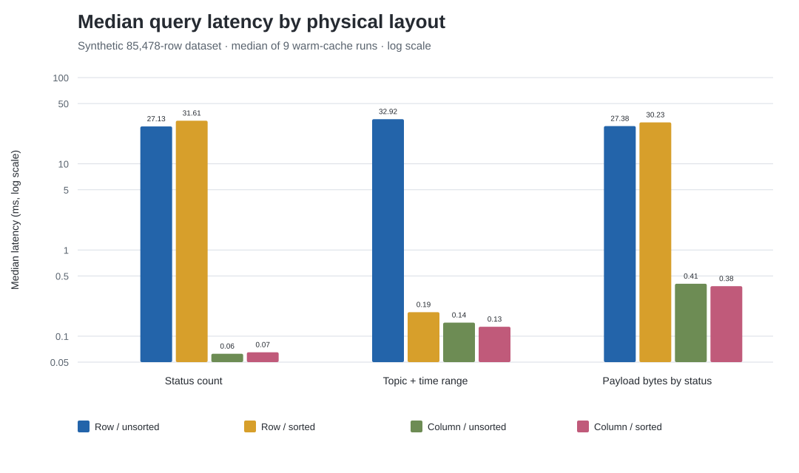
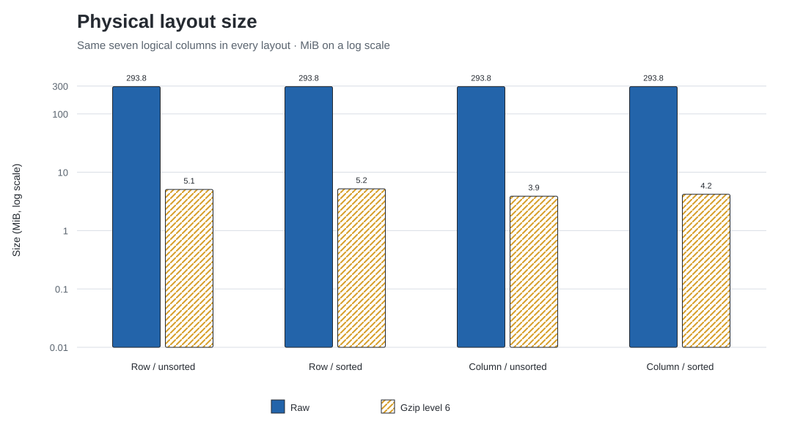
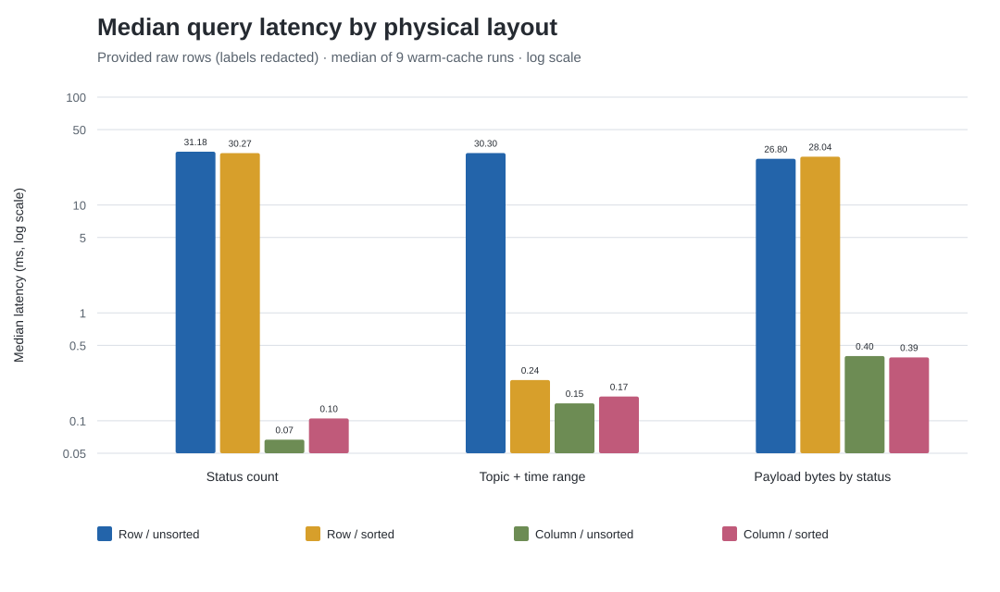
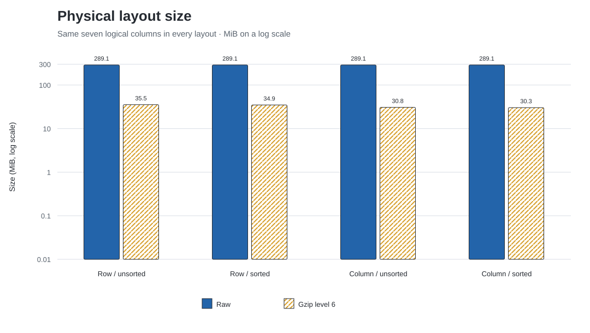

# C-Store physical-layout POC

## TL;DR

On a deterministic **synthetic** dataset shaped like the supplied SQLite database (85,478 rows, seven columns), the C-Store idea works strongly for narrow analytical reads:

- Unsorted column layout was **433.8x faster** for a single-column status count and **67.4x faster** for summing payload lengths by status.
- For a topic/time range predicate, unsorted column layout was **229.2x faster** than unsorted rows; a row projection sorted on `(topic, time, id)` was **173.4x faster** than the unsorted row scan.
- Raw size was effectively identical because both custom encodings store the same values without padding. Under identical gzip settings, the unsorted column files used **23.2% less space** than the unsorted row file.
- Sorting did **not** reduce total compressed size in this mock. It improved the sort-key query, but modestly worsened compression for other shuffled columns. That is a useful caution: a projection earns its space only when its workload benefit justifies the extra ordering.

## Raw database cross-check (aggregate results only)

I repeated the same custom-layout benchmark on a private neutral extraction of the provided rows. The extract and all four raw-derived binary layouts remain outside the deliverables and repository. The published result contains only aggregate timings, byte counts, row counts, and redacted workload parameters—no source path/hash, IDs, user IDs, topic labels, descriptions, JSON payloads, or row-level output.

The result confirms the synthetic POC's direction:

- Unsorted column layout was **466.8x faster** for the status count, **208.9x faster** for the topic/time range, and **67.3x faster** for summing payload lengths by status.
- The sorted row projection was **127.1x faster** than the unsorted row scan for its matching topic/time predicate.
- Raw physical size again remained effectively identical. With identical gzip settings, the unsorted column files used **13.2% less space** than unsorted rows.
- Unlike the mock, sorting improved compression slightly on the real values: gzip size fell from 35.46 to 34.91 MiB for rows and from 30.78 to 30.32 MiB for columns.

### Raw database median latency (ms)

| Query | Row / unsorted | Row / sorted | Column / unsorted | Column / sorted |
| --- | --- | --- | --- | --- |
| Status count | 31.178 | 30.271 | 0.067 | 0.105 |
| Topic + time range | 30.304 | 0.238 | 0.145 | 0.168 |
| Payload bytes by status | 26.797 | 28.040 | 0.398 | 0.387 |

### Raw database physical size (MiB)

| Layout | Raw | Gzip level 6 |
| --- | --- | --- |
| Row / unsorted | 289.12 | 35.46 |
| Row / sorted | 289.12 | 34.91 |
| Column / unsorted | 289.12 | 30.78 |
| Column / sorted | 289.12 | 30.32 |

## Method

The implementation follows one focused aspect of Stonebraker et al., *C-Store: A Column-oriented DBMS* (VLDB 2005): column representation plus multiple sort orders (“projections”).

1. SQLite is opened read-only only to derive aggregate shape: schema, row count, ranked category frequencies, status counts, time bounds, distinct-user count, and text-length quantiles.
2. No source path, file hash, IDs, category labels, descriptions, or payloads are retained. A seeded generator creates mock rows with synthetic IDs, labels, descriptions, and JSON-like payloads.
3. Four custom binary layouts are built from the mock CSV snapshot: row/column × unsorted/sorted by `(topic, time, id)`.
4. Timed queries use only those binary files. SQLite is never used for a benchmark query.
5. Each result is the median of 9 warm-cache measurements after 2 warmups. Every query returned the same value in all four layouts.

This isolates the paper's physical-layout claim, but it is not a full DBMS comparison: there is no optimizer, transaction system, buffer manager, vectorized row executor, concurrent workload, or cold-cache control.

## Median query latency (ms)

| Query | Row / unsorted | Row / sorted | Column / unsorted | Column / sorted |
| --- | --- | --- | --- | --- |
| Status count | 27.131 | 31.606 | 0.063 | 0.065 |
| Topic + time range | 32.917 | 0.190 | 0.144 | 0.129 |
| Payload bytes by status | 27.378 | 30.228 | 0.406 | 0.380 |

The column reader touches only the needed arrays. The row reader must step through the packed record stream, whose record headers are interleaved with roughly 294 MiB of mock text payload. The sorted range query uses binary search, so the row projection drops from a full scan to a few dozen key probes.

## Physical size (MiB)

| Layout | Raw | Gzip level 6 |
| --- | --- | --- |
| Row / unsorted | 293.75 | 5.07 |
| Row / sorted | 293.75 | 5.21 |
| Column / unsorted | 293.75 | 3.89 |
| Column / sorted | 293.75 | 4.19 |

The raw formats are intentionally dense and nearly identical in total size. Column compression wins because homogeneous values are compressed separately. The result is directionally consistent with the paper, while much smaller than C-Store's published end-to-end advantage because this POC applies generic gzip and does not execute directly on compressed encodings.

## Workload

- `status_count`: count rows matching the minority status (`1`).
- `topic_time_count`: count the largest synthetic topic between `2019-12-10 11:06:07` and `2021-04-29 22:29:07`.
- `payload_bytes_for_status`: sum description + payload byte lengths for the minority status without materializing text.

## Decision

For this database shape, a column-oriented read path is worth prototyping if the production workload is dominated by scans/aggregates over a few fields. Add a sorted `(topic_name, time)` projection only if that predicate is frequent enough to justify maintaining another physical ordering. Keep a row-oriented path (or reconstruct-on-demand path) for writes and wide record retrieval; this POC does not claim column layout wins there.
